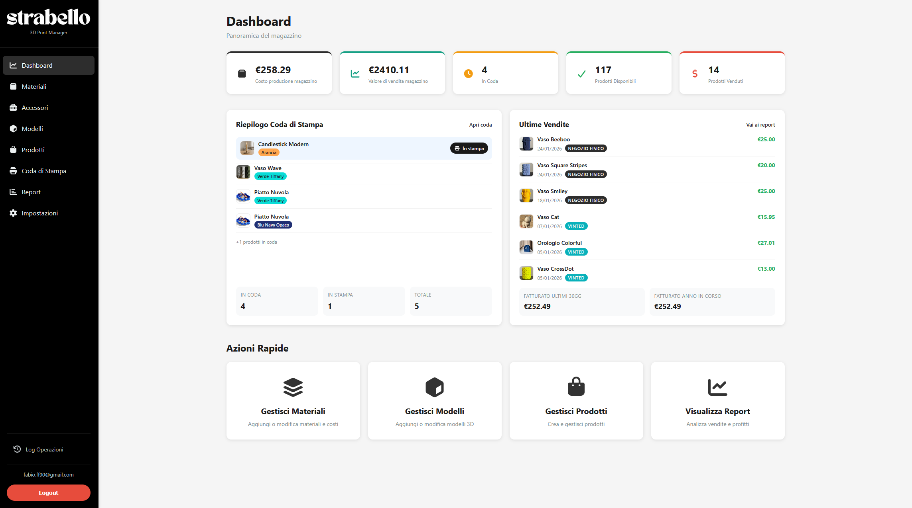
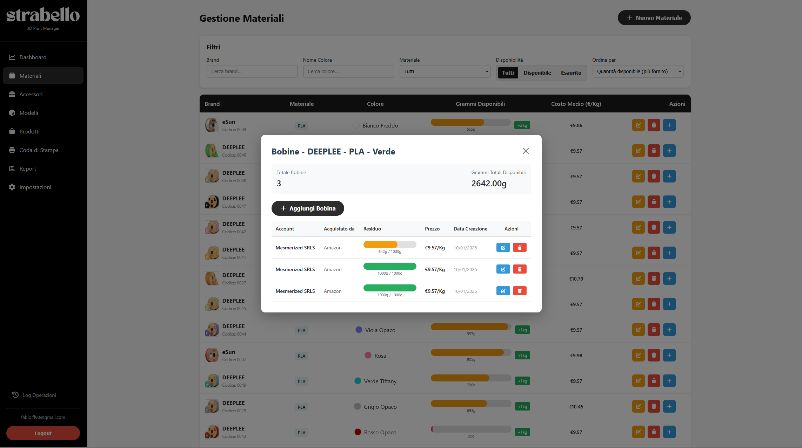

# Strabello Manager

Applicazione web per gestire inventario, costi e vendite di prodotti stampati in 3D. Centralizza materiali, modelli e prodotti, calcola i costi di produzione e genera report di vendita con ripartizione profitti.

## Panoramica

Strabello Manager nasce per chi produce e vende oggetti stampati in 3D: consente di tenere traccia di materiali, modelli e prodotti finiti, con flussi chiari dall’idea alla vendita. L’obiettivo è avere in un unico posto catalogo, costi e risultati economici.

## Screenshot

</img>
</img>
</img>


## Funzionalità principali

- Autenticazione con email/password
- Gestione materiali (costo al kg)
- Gestione modelli (foto, peso, dimensioni)
- Gestione prodotti (stati: in coda, disponibile, venduto)
- Report vendite e riepilogo costi
- Suddivisione profitti 60/40 (produttore/venditore)

## Setup rapido

1. Installa le dipendenze:
```bash
npm install
```

2. Crea un file `.env` nella root del progetto con le credenziali Supabase:
```
VITE_SUPABASE_URL=your_supabase_url
VITE_SUPABASE_ANON_KEY=your_supabase_anon_key
```

3. Esegui il database setup SQL in Supabase (vedi `supabase/schema.sql`)

4. Avvia il server di sviluppo:
```bash
npm run dev
```
